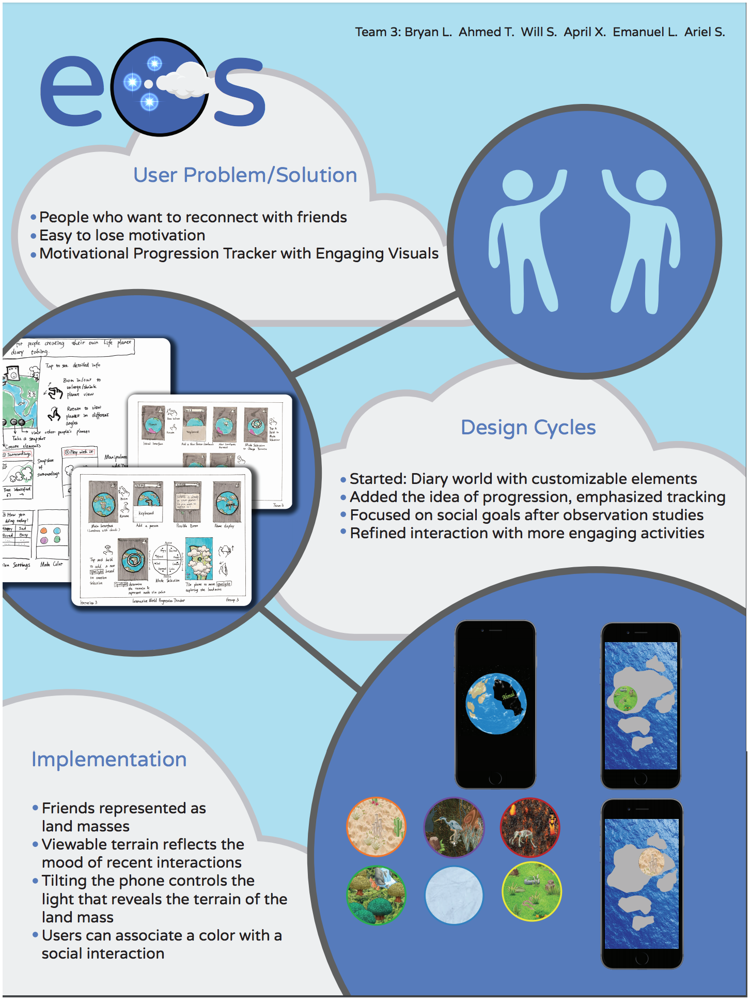

     ,-----.,--.                  ,--. ,---.   ,--.,------.  ,------.
    '  .--./|  | ,---. ,--.,--. ,-|  || o   \  |  ||  .-.  \ |  .---'
    |  |    |  || .-. ||  ||  |' .-. |`..'  |  |  ||  |  \  :|  `--, 
    '  '--'\|  |' '-' ''  ''  '\ `-' | .'  /   |  ||  '--'  /|  `---.
     `-----'`--' `---'  `----'  `---'  `--'    `--'`-------' `------'
    ----------------------------------------------------------------- 

Welcome to your Rails project on Cloud9 IDE!

To get started, just do the following:

1. Run the project with the "Run Project" button in the menu bar on top of the IDE.
2. Preview your new app by clicking on the URL that appears in the Run panel below (https://final-project-zeegeeko.c9users.io/).

Happy coding!
The Cloud9 IDE team

## DESIGN DESCRIPTION
EOS is a virtual world which incentivizes users to keep in touch with friends by picking at their curiosity and creativity in creating their world and discovering and developing it through interacting and reconnecting with old friends. Users can match their friends with one of the six landmasses on the virtual planet. The landmasses are initially all covered with fog which indicates the user has not started to get in touch with this friend. EOS has a spotlight feature to illuminate the landmass. As the user interacts with friends more, more spotlights will be added on that particular landmass. The color of the spotlight is customized by the user based on their feelings when hanging out with friends implicitly. For each landmass, a 2D view allows the user to tilt the phone to control the spotlight. The fog disappears as the spotlight moves, and random elements may appear, which seems like driving a car to explore your virtual world.

